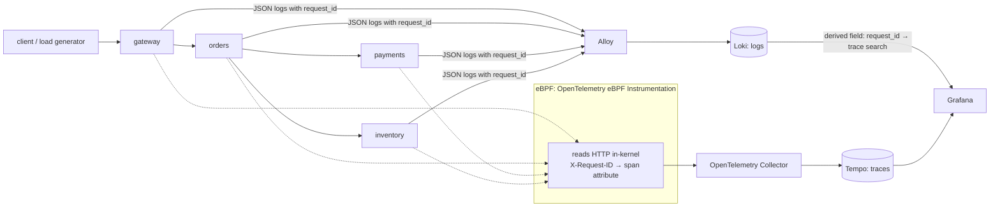
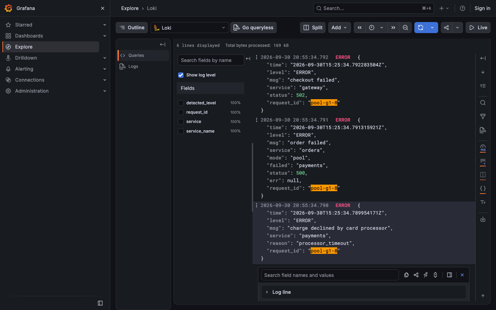
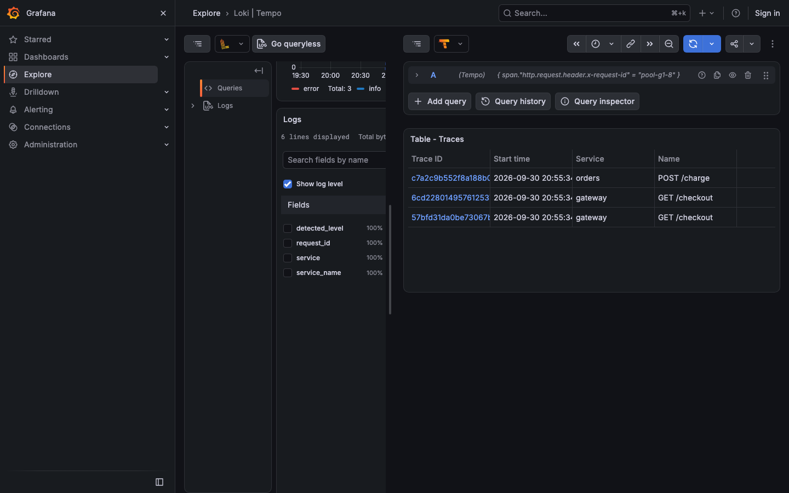

# baton-relay

**A small system of Go services, traced by eBPF with zero instrumentation, where one log line opens its full trace.**

This is the demo companion to [**baton**](https://github.com/agarwalvivek29/baton), built for the MumbaiFOSS 2026 talk *"eBPF Sees Every Request. Your Service Has No Idea Which Trace It's In."*

> 🚧 Pre-release. Runs today (see *Run it*); it builds against a local `baton` checkout until baton v0.1.0 is tagged.

## What you'll see

1. Send a request that fails somewhere deep in the chain.
2. Find the error log line. It has a `request_id`, but no trace ID.
3. Click it and land on the **full distributed trace**, across services that contain **no tracing code**.

## Architecture



- **Services** (`gateway`, `orders`, `payments`, `inventory`): plain Go `net/http`. The **only** extra code is [`baton`](https://github.com/agarwalvivek29/baton): middleware, client transport and log handler.
- **OBI** ([OpenTelemetry eBPF Instrumentation](https://github.com/open-telemetry/opentelemetry-ebpf-instrumentation) v0.13.0): traces every service from the kernel and captures `X-Request-ID` as a span attribute.
- **Grafana**: a log line's `request_id` links to a TraceQL **search**, so one click returns every trace carrying that ID, even when eBPF split the request into several.

Every component is FOSS.

## Layout

```
baton-relay/
├── services/
│   ├── gateway/         # the edge: baton mints the ID here
│   ├── orders/          # fans out: FANOUT_MODE=sync|go|pool
│   ├── payments/        # flaky (?fail=1, FAIL_RATE), so there's something to debug
│   ├── inventory/
│   └── Dockerfile       # one image per service (--build-arg SERVICE=...)
├── deploy/
│   ├── docker-compose.yml
│   ├── obi.yml          # eBPF agent: header capture, every key cited to upstream source
│   ├── otel-collector.yml, tempo.yml, loki.yml, alloy.config
│   └── grafana/provisioning/datasources/   # Loki → Tempo log link
├── scripts/
│   ├── break-it.sh      # good requests + one that fails at payments; prints its ID
│   ├── fanout.sh        # requests through each fan-out mode; prints IDs
│   ├── count-traces.py  # per request: #traces eBPF produced, ID on every hop?
│   └── count-by-window.py
└── docs/goroutines.md   # measured results
```

## Run it

**You need:** Docker with a Linux kernel that has eBPF and BTF (≥ 5.8). This is tested on **Docker Desktop for Mac on Apple Silicon** (kernel 6.12.76-linuxkit) and should work on any recent Linux host. The eBPF agent runs `privileged` with `pid: host`.

Until baton v0.1.0 is tagged, clone both repos side by side:

```bash
git clone https://github.com/agarwalvivek29/baton
git clone https://github.com/agarwalvivek29/baton-relay
cd baton-relay/deploy
docker compose up -d --build        # ~1 min the first time
cd .. && ./scripts/break-it.sh      # prints the failing request's ID
```

Open <http://localhost:3000/explore> (no login). In **Loki**, run `{service=~".+"} |= "<the ID>"`. Open the `ERROR` line, then **Links → "Find every trace for this request"**.




Tempo needs about a minute before new spans are searchable. If the trace search comes back empty, wait and run it again.

**Fan-out modes:** `./scripts/fanout.sh` sends one request per mode and prints each ID. `docs/goroutines.md` has the measured results: eBPF split up to 55% of requests into several traces, and the request ID was on every hop of every request.

## Try breaking it

The demo also shows the sharp edges:

- **Make a call with `context.Background()`:** `curl -H 'X-Request-ID: drop-1' 'localhost:8080/checkout?drop_ctx=1'`, or set `DROP_CONTEXT=1` for `orders`. The ID is dropped at orders → payments. orders logs `outbound call has no request ID`, and payments' logs get a different ID, so the log/trace join breaks right there.
- **Remove `baton` from one service:** the chain breaks at that hop, and the ID is lost from there on.

## Roadmap

- [x] Four services + baton wired in, with goroutine fan-out modes
- [x] docker-compose with OBI, Collector, Tempo, Loki, Alloy, Grafana
- [x] Log → trace search link pre-provisioned in Grafana
- [x] `break-it.sh`, `fanout.sh` + measured results (`docs/goroutines.md`)
- [ ] Switch to a tagged baton release
- [ ] Recorded walkthrough video

## License

[Apache-2.0](LICENSE)
