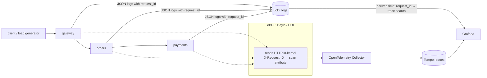

# baton-relay

**A small system of Go services, traced by eBPF with zero instrumentation, where one log line opens its full trace.**

This is the demo companion to [**baton**](https://github.com/agarwalvivek29/baton), built for the MumbaiFOSS 2026 talk *"eBPF Sees Every Request. Your Service Has No Idea Which Trace It's In."*

> 🚧 Early stage. The architecture below is the plan. It will be runnable before Oct 31, 2026.

## What you'll see

1. Send a request that fails somewhere deep in the chain.
2. Find the error log line. It has a `request_id`, but no trace ID.
3. Click it and land on the **full distributed trace**, across services that contain **no tracing code**.

## Architecture



- **Services** (`gateway`, `orders`, `payments`): plain Go `net/http`. The **only** extra code is [`baton`](https://github.com/agarwalvivek29/baton): middleware, client transport and log handler.
- **Beyla / OBI**: traces every service from the kernel and captures `X-Request-ID` as a span attribute.
- **Grafana**: a log line's `request_id` links to a trace search, so one click takes you from log to trace.

Every component is FOSS.

## Planned layout

```
baton-relay/
├── services/
│   ├── gateway/
│   ├── orders/
│   └── payments/        # has a flaky endpoint, so there's something to debug
├── deploy/
│   ├── docker-compose.yml   # one command, runs on a laptop (Linux or Docker Desktop)
│   ├── beyla.yml            # header capture config
│   ├── otel-collector.yml
│   └── grafana/             # datasources + log→trace link, pre-provisioned
└── scripts/
    └── break-it.sh          # fires a request that fails at payments
```

## Run it (planned)

```bash
git clone https://github.com/agarwalvivek29/baton-relay
cd baton-relay/deploy
docker compose up
./scripts/break-it.sh
# open http://localhost:3000 → Explore → Loki → click the error's request_id
```

> Beyla needs a Linux kernel with eBPF support and elevated privileges. The compose file will document exactly what's required.

## Try breaking it

The demo also shows the sharp edges:

- **Remove `baton` from one service:** the chain breaks at that hop and one request becomes two traces.
- **Make a call with `context.Background()`:** the ID is silently dropped.

## Roadmap

- [ ] Three services + baton wired in
- [ ] docker-compose with Beyla, Collector, Tempo, Loki, Grafana
- [ ] Log → trace link pre-provisioned in Grafana
- [ ] `break-it.sh` + a "sharp edges" walkthrough
- [ ] Recorded walkthrough video

## License

[Apache-2.0](LICENSE)
