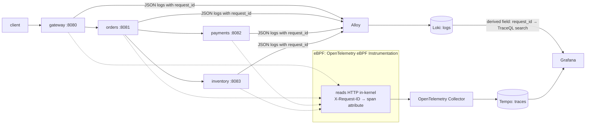

# baton-relay

**Four Go services, traced by eBPF with zero instrumentation. One click on an error log finds every trace of that request.**

[](LICENSE)


This is the runnable companion to [**baton**](https://github.com/agarwalvivek29/baton), built for the MumbaiFOSS 2026 talk *"eBPF Sees Every Request. Your Service Has No Idea Which Trace It's In."*

> Uses [baton v0.1.0](https://github.com/agarwalvivek29/baton/releases/tag/v0.1.0).

---

- [What it shows](#what-it-shows)
- [Architecture](#architecture)
- [Run it](#run-it)
- [Walkthrough](#walkthrough)
- [Fan-out modes and measured results](#fan-out-modes-and-measured-results)
- [Try breaking it](#try-breaking-it)
- [Configuration](#configuration)
- [Troubleshooting](#troubleshooting)
- [Layout](#layout)

## What it shows

1. A request fails deep in the chain, at `payments`.
2. The error log line has a `request_id`, but no trace ID. The services contain **no tracing code**.
3. One click runs a Tempo search by that ID and returns **every trace** of the request. That includes the pieces eBPF split into separate traces.


Measured on this stack, eBPF split up to 55% of requests into several traces, and the request ID was on **every hop of all 80 requests** measured. See [docs/goroutines.md](docs/goroutines.md).

## Architecture



| Component | Role |
|---|---|
| `gateway`, `orders`, `payments`, `inventory` | Plain Go `net/http`. The only extra code is [baton](https://github.com/agarwalvivek29/baton): middleware, client transport, log handler. |
| [OBI](https://github.com/open-telemetry/opentelemetry-ebpf-instrumentation) v0.13.0 | eBPF agent. Traces every service from the kernel and records `X-Request-ID` on each span. |
| OpenTelemetry Collector 0.161.0 | Receives OTLP from OBI and exports it to Tempo. |
| Tempo 3.1.0 | Trace store, TraceQL search. |
| Loki 3.7.8 + Alloy v1.20.1 | Ships the services' JSON stdout from Docker into Loki. |
| Grafana 13.2.3 | Pre-provisioned datasources. A Loki derived field turns `request_id` into a Tempo TraceQL search. |

Every component is FOSS, and every image tag is pinned.

## Run it

**Prerequisites**

- Docker with Compose v2, on a Linux kernel with eBPF and BTF (5.8 or newer).
- Tested on **Docker Desktop for Mac, Apple Silicon** (kernel 6.12.76-linuxkit). Any recent Linux host should work.
- The eBPF agent runs `privileged` with `pid: host`, so run this on a machine you control.
- Free ports: 3000 (Grafana), 3100 (Loki), 3200 (Tempo), 8080 (gateway).

**Start**

```bash
git clone https://github.com/agarwalvivek29/baton-relay
cd baton-relay/deploy
docker compose up -d --build        # about a minute the first time
```

**Stop**

```bash
docker compose down        # add -v to also delete stored logs and traces
```

## Walkthrough

```bash
cd baton-relay
./scripts/break-it.sh
```

```
sent      feb454c83f3ce29edbf78e8151cb7108
...
FAILING   46ea23bbb8161fd7c1994f1357029de2
```

1. Open <http://localhost:3000/explore> (no login). Choose **Loki** and run `{service=~".+"} |= "<the failing ID>"`.
2. You'll see lines from all four services, including the payments `ERROR`.
3. Open the `ERROR` line, then **Links → "Find every trace for this request"**.
4. Tempo opens beside the logs and lists every trace that carries the ID.

Tempo needs about a minute before new spans are searchable. If the trace search comes back empty, wait and run it again.

## Fan-out modes and measured results

`orders` calls `payments` and `inventory` in one of three ways. Set it per request with `?mode=`, or for the whole service with `FANOUT_MODE`:

| Mode | How `orders` makes the two calls |
|---|---|
| `sync` | one after the other, on the request goroutine |
| `go` | one `go func()` per call, joined with a `WaitGroup` |
| `pool` | jobs sent over a channel to a worker pool started at boot. The job carries the request's `ctx`. |

```bash
./scripts/fanout.sh                        # one request per mode; prints each ID
N=20 RUN=r1 ./scripts/fanout.sh            # 20 per mode
sleep 60 && python3 scripts/count-traces.py pool-r1 20
```

The headline numbers, measured with OBI v0.13.0 on kernel 6.12.76 (details and method in [docs/goroutines.md](docs/goroutines.md)):

- **Go-specific eBPF tracers:** `sync` and `go` gave 1 trace per request. **`pool` gave 3 traces per request, 10 of 10 times.** The worker pool breaks eBPF's goroutine tracking.
- **Generic eBPF tracer (the default here):** the request ID was on **all 7 hops for 80 of 80 requests**, even though eBPF split them into 1 to 4 traces.

## Try breaking it

- **Drop the context.** Run `curl -H 'X-Request-ID: drop-1' 'localhost:8080/checkout?drop_ctx=1'`, or set `DROP_CONTEXT=1`. `orders` then calls `payments` with `context.Background()`:
  - `orders` logs `WARN outbound call has no request ID`, from baton's `WithOnMissing` hook.
  - `payments` logs under a **different** ID.
  - The search for `drop-1` finds every hop except `payments`. The join breaks exactly there.
- **Force a failure:** `curl 'localhost:8080/checkout?fail=1'`.
- **Remove baton from one service:** the chain breaks at that hop, and the ID is lost from there on.

## Configuration

These environment variables are read by `deploy/docker-compose.yml`. Set them in your shell, or in a `.env` file next to it.

| Variable | Default | Effect |
|---|---|---|
| `FANOUT_MODE` | `sync` | Default fan-out mode for `orders` (`sync`, `go`, `pool`) |
| `DROP_CONTEXT` | `0` | `1` makes `orders` call `payments` with `context.Background()` |
| `FAIL_RATE` | `0.2` | Chance that `payments` fails a request |
| `OBI_LOG_LEVEL` | `INFO` | eBPF agent log level |
| `OBI_TRACE_PRINTER` | `disabled` | `json` prints every span to OBI's stdout (for debugging) |

The eBPF agent's settings are in [`deploy/obi.yml`](deploy/obi.yml). Each key is commented with a link to the upstream source at v0.13.0.

## Troubleshooting

| Symptom | Cause and fix |
|---|---|
| Trace search is empty right after a request | Tempo makes spans searchable after about 60 s. Wait and retry. |
| OBI logs `ERROR context propagation is disabled ... FIONREAD` | Expected on kernels 6.6.128+, 6.12.75+, 6.18.14+ and 6.19+. OBI turns off one propagation method to protect apps, so eBPF splits more requests into several traces. The request-ID search still finds all of them. |
| No `x-request-id` attribute on any span | OBI needs `/sys/kernel/tracing` mounted, as the compose file does. Also check that `ebpf.buffer_sizes.http` is above 0. |
| `docker compose down` says OBI's PID "is zombie" | Docker Desktop can take a few seconds to release an eBPF agent. Wait about 10 s and run it again. |
| Only the first span has the ID | You're running OBI's Go-specific tracers. Keep `skip_go_specific_tracers: true`; see [docs/goroutines.md](docs/goroutines.md). |

## Layout

```
baton-relay/
├── services/
│   ├── gateway/         # the edge: baton mints the ID here
│   ├── orders/          # fans out: sync | go | pool
│   ├── payments/        # flaky (?fail=1, FAIL_RATE), so there's something to debug
│   ├── inventory/
│   └── Dockerfile       # one image per service (--build-arg SERVICE=...)
├── deploy/
│   ├── docker-compose.yml
│   ├── obi.yml          # eBPF agent config, every key cited
│   ├── otel-collector.yml, tempo.yml, loki.yml, alloy.config
│   └── grafana/provisioning/datasources/   # Loki → Tempo log link
├── scripts/
│   ├── break-it.sh      # good requests plus one that fails at payments
│   ├── fanout.sh        # requests through each fan-out mode
│   ├── count-traces.py  # per request: traces produced, ID on every hop?
│   └── count-by-window.py
└── docs/goroutines.md   # measured results
```

## Roadmap

- [x] Four services with baton, including goroutine fan-out modes
- [x] Compose stack: OBI, Collector, Tempo, Loki, Alloy, Grafana
- [x] Log → trace search link, pre-provisioned
- [x] Scripts and measured results
- [x] Switch to a tagged baton release (v0.1.0)
- [ ] Measure on a kernel without the FIONREAD bug
- [ ] Recorded walkthrough video

## Contributing

See [CONTRIBUTING.md](CONTRIBUTING.md). Security issues: [SECURITY.md](SECURITY.md).

## License

[Apache-2.0](LICENSE). See [NOTICE](NOTICE).
